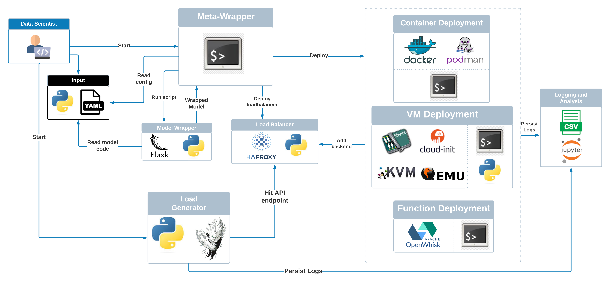

# MLDep: A Testbed for Performance Exploration of Machine Learning Inference Serving

# Requirements

Also refer to the READMEs of the respective sub-folders in the repo

### Container Deployment

1. Docker

### VM Deployment

1. Libvirt, virtinst

### Function Deployment

1. Go
2. OpenWhisk - https://openwhisk.apache.org/documentation.html#openwhisk_deployment
3. OpenWhisk CLI - https://github.com/apache/openwhisk-cli/releases/tag/1.2.0
4. Gradle
5. Node.JS
6. OpenJDK/Java1.8
